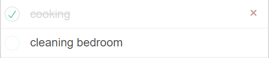

# Getting Started with TodoList App

Your site is live at [here](https://jessiicamaru.github.io/todo/).

## Features

-   [Add work](#add-work)
-   [Mark as done](#mark-as-done-mark-as-uncompleted)
-   [Mark as uncompleted](#mark-as-done-mark-as-uncompleted)
-   [Delete work](#delete-work)
-   [Edit work](#edit-work)
-   [Filter work](#filter)
-   [Mark all work uncompleted](#mark-all-work-completed-mark-all-work-uncompleted)
-   [Mark all work completed](#mark-all-work-completed-mark-all-work-uncompleted)
-   [Use mock API to ave configuration and works when exit, close website](#use-mock-api-to-ave-configuration-and-works-when-exit-close-website)

### `Add work`

Type your work name in the input field and press enter to add.

### `Mark as done, Mark as uncompleted`

Click on the circle button on the left side of each item to mark and unmark.

### `Delete work`

Hover on the item that you want to delete then the delete button will appear on the right side.

### `Edit work`

Double click on the item that you want to edit then the input field will appear. Change the name of the value and press enter, the name will be replaced but the state of finishing will not.

### `Mark all work completed, Mark all work uncompleted`

Click the button on the left, next to the input field to set all work completed. Click the text clear completed to clear all work completed.

### `Filter`

"All" filter will show off all works.

"Active" filter will show off all works that didn't complete.

"Completed" filter will show off all works that were completed.

### `Use mock API to ave configuration and works when exit, close website`

When you reload, close, exit, the website will annouce to you and call API and save configuration and data.

## Contact

-   Gmail: [Dandrew2407@gmail.com]()
-   Instagram: [_dung.24_](https://www.instagram.com/_dung.24_/)
-   Facebook: [Dũng Hoàng](https://www.facebook.com/dunghoang24/)
